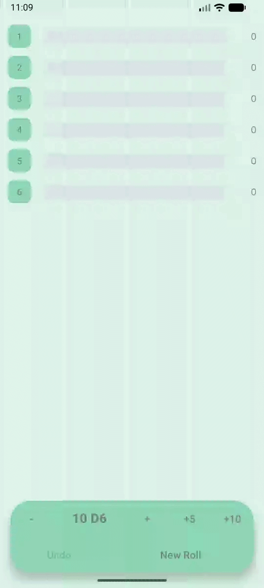
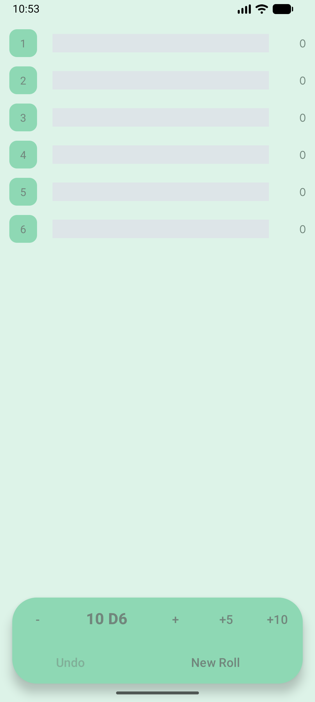
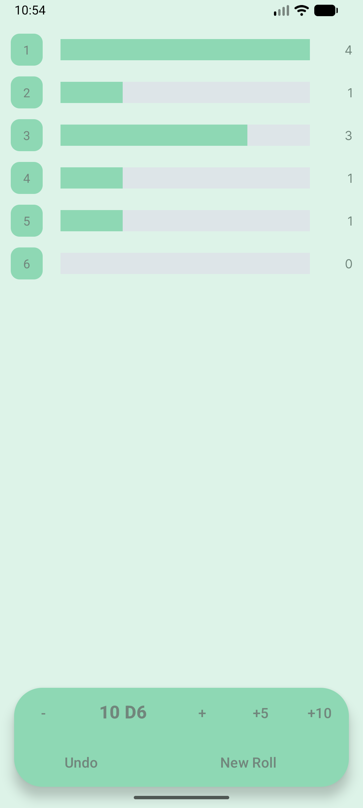
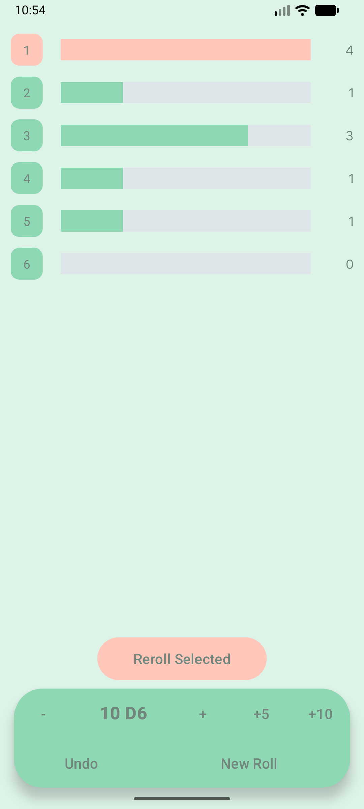
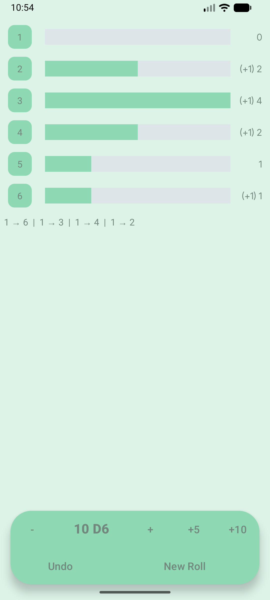
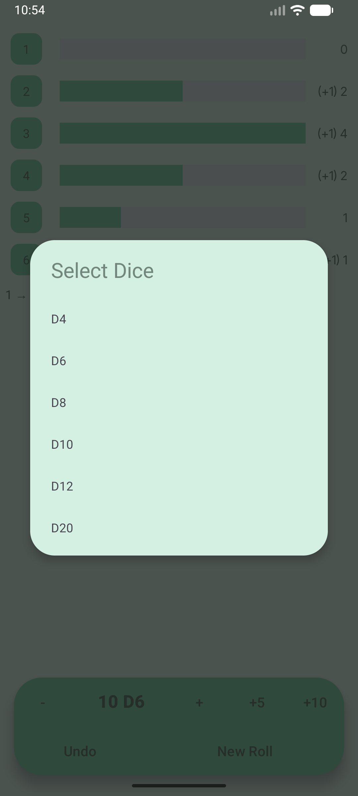
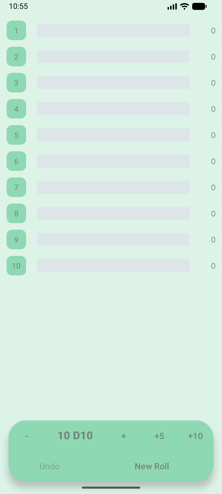

# 🎲 Dice Roller – Java Project

This project implements a dice simulation application designed for tabletop games, where players often need to roll a large number of dice at once and selectively reroll specific results according to game rules.

The application supports multiple dice rolls, different dice types, selective rerolling, histogram-based result aggregation, and undo functionality. While it includes a clean and modern user interface, the core logic is framework-independent and designed with clear separation of concerns in mind.

It was developed as the final project for Harvard's CS50x – Introduction to Computer Science.

---
## 📱 Preview

### 🎬 Demo

  

---

### 🖼 Screenshots

  
  
  

  
  
  

---
## 🎯 Project Goals
The project focuses on:

- Developing an application with a real-world use case, inspired by tabletop games
- Gaining hands-on experience with core Java concepts
- Designing a reusable and framework-independent business logic layer
- Using structured version control with Git

---
## 🛠 Tech Stack

- Java
- Android SDK
- Git

---
## 🏗 Project Structure

The project is divided into two main layers: a framework-independent logic layer and an Android-based UI layer. The business logic is fully separated from the presentation layer to ensure modularity and reusability.

### 🔹 Logic Layer (`logic` package)

#### `Dice.java`
Represents a single die with a configurable number of sides.  
It encapsulates the random roll generation logic and abstracts the randomness from the rest of the application.

Functionality:
- Store number of sides
- Generate random roll results

---

#### `DiceRoller.java`
The core class of the application.

Functionality:
- Rolling multiple dice
- Selective rerolling
- Histogram generation
- Undo functionality
- State management

The class maintains an internal list of roll results and an undo stack implemented using a `Deque<List<Integer>>`. Before each mutating operation, a copy of the current state is stored to allow controlled rollback.

The undo history is intentionally limited to prevent uncontrolled memory growth.

---

#### `RerollResult.java`
A small data holder class used to encapsulate the result of reroll operations.

Instead of returning multiple lists separately, this class groups:
- Old values
- New values

Keeping the lists separate allows precise mapping of which specific result was rerolled into which new value. This makes it possible to display detailed reroll information in the UI (e.g., "4 → 6") while keeping the logic layer clean.

---

### 🔹 UI Layer (`ui` package)

#### `MainActivity.java`
Acts as a controller between the UI and the logic layer.

Responsibilities:
- Initialize logic classes
- Handle user interactions
- Update RecyclerView
- Manage state persistence during configuration changes
- Display first-run information dialog

All business operations are delegated to `DiceRoller`, keeping UI logic separate from application logic.

---

#### `HistogramAdapter.java`
RecyclerView adapter responsible for displaying histogram data.

It manages:
- Data updates
- Selection logic
- Highlighting changes
- Increment visualization after rerolls

---

#### `HistogramItem.java`
Simple data model representing a single histogram entry (dice value and count).

---
## 🧠 Design Decisions

- Clear separation between UI and business logic to improve maintainability
- Undo mechanism implemented using a bounded Deque with explicit state copying to ensure predictable rollback and controlled memory usage
- Use of a dedicated RerollResult data class to preserve precise mapping between old and new values

---
## 🚀 How to Run

1. Clone the repository
2. Open the project in Android Studio
3. Build and run on emulator or physical device

